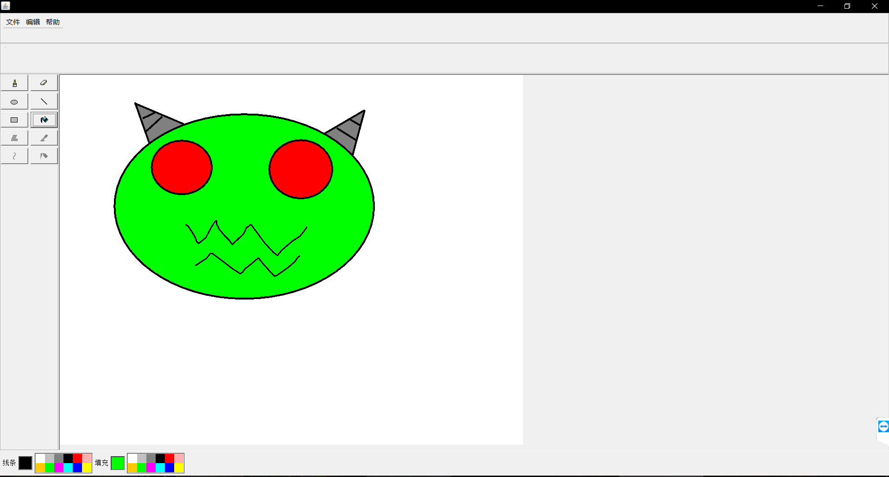

# SwingPainter
一个本来想做成像Windows Xp风格的画图板。（其实只是个大作业）

# feature
目前完成的功能:
 - 直线，橡皮，椭圆，笔刷，矩形，油漆桶
 - 保存图像为jpg。
 - 打开图像。
 - 撤销，重做。
 - 选择颜色。

# plan
先把作业交了。等闲的蛋疼继续做。先挖个巨坑。
- 改进填充算法。目前填充算法在填充比较大的区域(大概2000x2000)就会StackOverflow。
- 改进撤销重做机制。目前的撤销重做机制用的是存储每一次绘图结果的图像，消耗内存巨大。(所以Window绘图到底怎么做到几乎不耗内存的)
- 增加剩余的功能。取色，曲线，多边形，保存图像格式增加。
- 添加画完图像后可以移动的功能。(这似乎又是一个巨坑，吐槽一下垃圾swing)
- 引入Spring简化代码。
- 以此研究设计模式?
